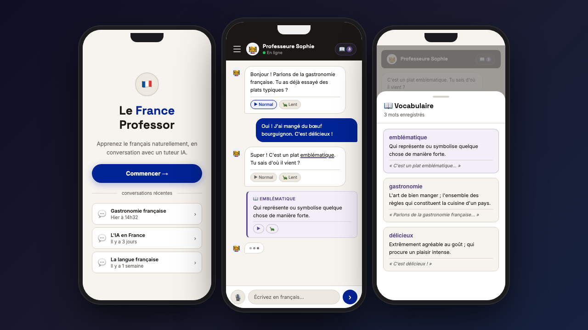

# Le France Professor

A French learning application where students chat with an AI tutor powered by a local LLM.



## Features

- **Chat Interface** — Interactive French conversation with an AI tutor. The tutor initiates each conversation on an interesting topic (AI in France, French culture, French in the world) and adapts to the student's level.
- **Voice Input** — Speak French directly into the chat. Audio is transcribed via whisper.cpp and placed in the input box for review before sending. Adaptive UX: click-to-toggle on desktop, press-and-hold on mobile. A live recording timer and transcription status keep students informed.
- **Text-to-Speech** — Every tutor response has a speaker (▶) and slow-play (🐢) button. Audio is synthesised locally via piper1-gpl. Slow mode uses server-side `length_scale` for genuinely slower phoneme duration, not browser pitch-shifting. Only one message plays at a time.
- **Slash Commands** — Type `/vocabulary [word]` for a contextual explanation of any French word. Typing `/` opens an autocomplete popup. The result appears as a `📖 word` card inline in the chat and is saved to the vocabulary notebook.
- **Vocabulary Notebook** — A `📖 Vocabulaire` button opens a slide-in drawer listing every word saved for the current conversation. Saved words are underlined in the source tutor message — clicking a highlight opens the notebook scrolled to that entry. Bottom sheet on mobile, side drawer on desktop.
- **Recent Conversations** — The home page shows a "conversations récentes" list fetched server-side. Each entry shows the conversation title and a relative French date ("Hier à 14h32") and navigates directly to that conversation.
- **Multi-conversation Sidebar** — A persistent sidebar lists all conversations. Titles are generated by the LLM after the second student message (4–7 words). On mobile the sidebar is a full-height overlay drawer opened by a hamburger button.

## Quick Start

```bash
# Install all dependencies
npm install && cd backend && npm install && cd ../frontend && npm install

# Start the backend (port 3001)
npm run dev:backend

# Start the frontend (port 3000)
npm run dev:frontend
```

Open [http://localhost:3000](http://localhost:3000).

For full setup — Ollama model selection, whisper.cpp (voice), and piper1-gpl (TTS) — see [QUICKSTART.md](./QUICKSTART.md).

## Documentation

| | |
|---|---|
| [QUICKSTART.md](./QUICKSTART.md) | Full setup: env vars, Ollama, whisper.cpp, piper1-gpl, run & test commands |
| [ARCHITECTURE.md](./ARCHITECTURE.md) | Hexagonal layers, BFF pattern, DDD |
| [TESTING.md](./TESTING.md) | Testing strategy, conventions, commands |
| [OBSERVABILITY.md](./OBSERVABILITY.md) | OpenTelemetry traces, Grafana stack |
| [docs/decisions/](./docs/decisions/) | Architecture Decision Records — 27 decisions with source conversations |
| API docs | Interactive docs at `http://localhost:3001/docs` (backend must be running) |
